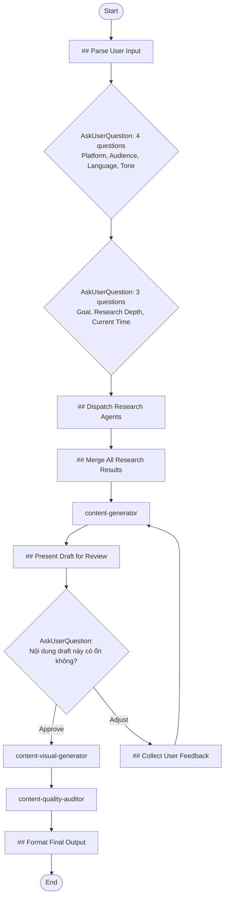

## Workflow Execution Guide

Follow the Mermaid flowchart above to execute the workflow. Each node type has specific execution methods as described below.

### Execution Methods by Node Type

- **Rectangle nodes with agent names** (e.g., `content-generator`): Execute Sub-Agents using the Task tool
- **Diamond nodes (AskUserQuestion:...)**: Use the AskUserQuestion tool to prompt the user
- **Rectangle nodes (Prompt nodes)**: Execute the prompts described in the details section below

### Prompt Node Details

#### fbp_parse_input(## Parse User Input)

```
## Parse User Input

User đã cung cấp topic/idea cho social media post:

**Input**: {{input}}

---

## Extracted Information

**Topic/Subject**: {{input}}

Đây là chủ đề mà user muốn viết bài. Thông tin này sẽ được truyền sang các bước tiếp theo.

---

*Topic đã được capture, tiếp tục workflow...*
```

#### fbp_dispatch_research(## Dispatch Research Agents)

```
## Dispatch Research Agents

Dựa trên thông tin user đã cung cấp, launch research agents IN PARALLEL.

### Collected Context
- **Platform**: {{platform}}
- **Topic**: {{topic}}
- **Audience**: {{audience}}
- **Language**: {{language}}
- **Tone**: {{tone}}
- **Goal**: {{goal}}
- **Research Depth**: {{researchDepth}}
- **Current Time**: {{currentTime}}

### Your Task

Analyze context và dispatch `research` instances using the Task tool.

**Research angles to cover:**
1. **Topic Facts & Statistics**: Core facts, statistics, and recent developments about {{topic}}
2. **Trending Content**: Current slang, memes, viral content for {{language}} audience
3. **Writing Style**: How to write {{tone}} content for {{platform}}
4. **Audience Preferences**: What {{audience}} wants to see on {{platform}}
5. **Competitor Analysis**: Successful posts about {{topic}} on {{platform}}
6. **Platform Policy**: {{platform}} guidelines, algorithm tips, shadowban triggers

### Research Depth Mapping
- **Quick**: 3 queries per angle
- **Medium**: 5 queries per angle
- **Deep**: 10+ queries per angle

### Execution

Launch ALL research agents in ONE message (parallel execution) using the Task tool:

```
Task tool calls (all in parallel):
1. subagent_type: "research", model: "haiku"
   prompt: "Research topic: {{topic}}. Assigned angle: Topic facts & statistics. Current time: {{currentTime}}. Execute 3-5 searches to find key facts, statistics, recent news about this topic."

2. subagent_type: "research", model: "haiku"
   prompt: "Research topic: {{topic}} for {{language}} audience. Assigned angle: Trending content & slang. Current time: {{currentTime}}. Execute 3-5 searches to find current slang, memes, viral expressions."

3. subagent_type: "research", model: "haiku"
   prompt: "Research topic: Writing style. Assigned angle: {{tone}} writing for {{platform}}. Execute 3-5 searches to find how to write {{tone}} content on {{platform}}, sentence patterns, emoji usage."

4. subagent_type: "research", model: "haiku"
   prompt: "Research topic: {{audience}} audience. Assigned angle: Audience preferences on {{platform}}. Execute 3-5 searches to find what {{audience}} wants, post length preferences, engagement patterns."

5. subagent_type: "research", model: "haiku"
   prompt: "Research topic: {{topic}} competitors. Assigned angle: Successful posts analysis on {{platform}}. Execute 3-5 searches to find viral posts, winning hooks, common mistakes."

6. subagent_type: "research", model: "haiku"
   prompt: "Research topic: {{platform}} policy. Assigned angle: Platform guidelines & algorithm. Execute 3-5 searches to find content rules, shadowban triggers, algorithm tips for {{platform}}."
```

**IMPORTANT**: Adjust number of agents and queries based on context. Not all angles may be needed for every post.
```

#### fbp_merge_research(## Merge All Research Results)

```
## Merge All Research Results

Combine findings from all research agents into a unified brief.

### User Requirements
- **Platform**: {{platform}}
- **Topic**: {{topic}}
- **Audience**: {{audience}}
- **Language**: {{language}}
- **Tone**: {{tone}}
- **Goal**: {{goal}}
- **Research Depth**: {{researchDepth}}

### Research Input

{{allResearchResults}}

---

## Synthesized Brief for Content Generator

### Platform Guidelines (CRITICAL)
- Content rules: [from platform policy research]
- Optimal format: [length, hashtags, etc.]
- What to avoid: [shadowban triggers, prohibited content]
- Algorithm tips: [what gets boosted]

### Key Facts to Include
[Extract most important facts from topic research]

### Available Slang & Expressions
[List ALL slang from trending research - do not filter]

### Humorous Phrases Pool
- General: [from trending research - list all]
- Topic-specific: [from trending research - list all]

### Current Events to Reference
- Topic-related: [from trending research]
- General trending: [from trending research]

### Tone & Writing Style Guide
- How to write this tone: [from writing style research]
- Sentence patterns: [from writing style research]
- Words to use/avoid: [from writing style research]
- Emoji guide: [from writing style research]
- Post structure: [from writing style research]

### Audience Insights
- What they want: [from audience research]
- Post length: [recommendation]
- CTA style: [recommendation]

### Competitive Edge
- Gap to exploit: [from competitor analysis]
- Hooks that work: [combined from all research]
- Mistakes to avoid: [from competitor analysis]

### Top 5 Hook Recommendations
1. [Best hook from all research]
2. [Second best hook]
3. [Third hook]
4. [Fourth hook]
5. [Fifth hook]

---

**This synthesized brief will be passed to the Content Generator.**
```

#### fbp_present_draft(## Present Draft for Review)

```
## Present Draft for Review

### Generated Content
{{generatedContent}}

---

# Draft Bài Post

Dựa trên research và yêu cầu của bạn, đây là draft:

{{generatedContent}}

---

**Bạn có thể:**
1. **Approve** - Tiếp tục tạo visual concepts
2. **Điều chỉnh** - Cho feedback để sửa

*Lưu ý: Sau khi approve, bài post sẽ được đưa qua Visual Generator và Quality Auditor trước khi hoàn tất.*
```

#### fbp_collect_feedback(## Collect User Feedback)

```
## Collect User Feedback for Revision

### Current Draft
{{generatedContent}}

### User's Feedback
{{userFeedback}}

---

## Parse Feedback

Analyze what the user wants to change:
- **Tone adjustment?** [yes/no - what]
- **Hook change?** [yes/no - what]
- **Length adjustment?** [yes/no - longer/shorter]
- **Message focus?** [yes/no - what]
- **Specific wording?** [yes/no - what]
- **Other?** [specify]

## Feedback Summary for Content Generator

**User requests the following changes:**
1. [Change 1]
2. [Change 2]
3. [Change 3 if any]

**Keep these elements:**
- [What user liked or didn't mention]

---

*This feedback will be passed back to Content Generator for revision.*
```

#### fbp_format_output(## Format Final Output)

```
## Format Final Output

### Quality Audit Result
{{auditResult}}

### Visual Concepts
{{visualConcepts}}

---

# {{platform}} Post Package - Ready to Publish

## Bài Post

{{auditResult.finalPost}}

---

## Hashtags
{{auditResult.hashtags}}

---

## Visual Concepts

{{visualConcepts}}

---

## Quality Score: {{auditResult.totalScore}}/60

{{auditResult.scoreTable}}

---

## Posting Tips

{{auditResult.postingRecommendations}}

---

## Checklist Trước Khi Đăng

- [ ] Copy nội dung vào {{platform}}
- [ ] Tạo/chọn hình ảnh theo visual concept
- [ ] Thêm hashtags (nếu phù hợp với {{platform}})
- [ ] Chọn thời điểm đăng phù hợp
- [ ] Chuẩn bị reply cho comments đầu tiên

---

**Workflow hoàn tất!**
```

### AskUserQuestion Node Details

Ask the user and proceed based on their choice.

#### fbp_ask_basic_info(4 questions: Platform, Audience, Language, Tone)

Use AskUserQuestion tool with **4 questions in ONE call**:

**Question 1 - Platform:**
- Header: "Platform"
- Question: "Bạn muốn đăng bài lên nền tảng nào?"
- Options:
  - Facebook: "Facebook post (feed, group, page)"
  - LinkedIn: "LinkedIn post (professional network)"
  - X (Twitter): "X/Twitter post (threads supported)"
  - Instagram: "Instagram caption (for feed post)"

**Question 2 - Audience:**
- Header: "Audience"
- Question: "Đối tượng mục tiêu của bài post là ai?"
- Options:
  - Developers/IT: "Lập trình viên, kỹ sư phần mềm"
  - Business: "Doanh nhân, startup founders"
  - Students: "Sinh viên, học sinh"
  - General: "Đối tượng rộng, không chuyên biệt"

**Question 3 - Language:**
- Header: "Language"
- Question: "Ngôn ngữ và quốc gia target?"
- Options:
  - Vietnamese-VN: "Tiếng Việt, đối tượng Việt Nam"
  - English-Global: "English, global audience"
  - English-US: "English, US-focused content"

**Question 4 - Tone:**
- Header: "Tone"
- Question: "Tone/giọng văn mong muốn?"
- Options:
  - Professional: "Chuyên nghiệp, formal"
  - Casual: "Thân thiện, gần gũi"
  - Humorous: "Hài hước, vui vẻ"
  - Inspirational: "Truyền cảm hứng, motivational"

#### fbp_ask_goals_config(3 questions: Goal, Research Depth, Current Time)

Use AskUserQuestion tool with **3 questions in ONE call**:

**Question 1 - Goal:**
- Header: "Goal"
- Question: "Mục tiêu chính của bài post?"
- Options:
  - Share Knowledge: "Chia sẻ kiến thức, giáo dục"
  - Promote: "Quảng bá sản phẩm/dịch vụ"
  - Engagement: "Tăng tương tác, thảo luận"
  - Personal Story: "Chia sẻ câu chuyện cá nhân"

**Question 2 - Research Depth:**
- Header: "Research"
- Question: "Mức độ research?"
- Options:
  - Quick: "Nhanh (3 queries/agent)"
  - Medium: "Cân bằng (5 queries/agent)"
  - Deep: "Toàn diện (10+ queries/agent)"

**Question 3 - Current Time:**
- Header: "Time"
- Question: "Thời gian hiện tại? (để search trends chính xác)"
- Options:
  - [AI suggests current month/year]: "Use actual current date"
  - Custom: "Nhập thời gian khác"

#### fbp_review_draft(Nội dung draft này có ổn không?)

**Selection mode:** Single Select

**Options:**
- **Approve, tiếp tục**: Nội dung OK, tạo visual concepts
- **Cần điều chỉnh**: Muốn sửa nội dung
